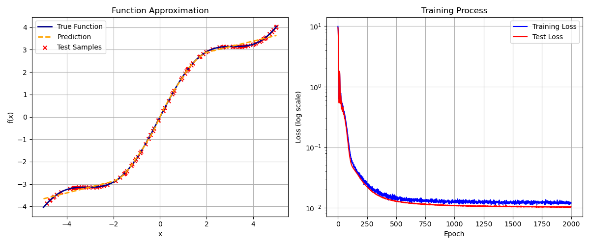

## 神经网络2.2：使用ReLU神经网络拟合任意函数

#####  作者：2251545 邢致远

---

#### 1.函数定义

​    在本次实验作业中，我尝试使用两层ReLU神经网络拟合一个基本的数学函数，由正弦函数和线性函数组成的多项式结构，其定义为

$f(x)=x+sin(x)$

#### 2.数据采集

​    本实验通过数值模拟方法生成训练集与测试集数据，具体流程如下：

  **2.1.数据生成范围**
    在区间 [−5,5] 内均匀采样生成输入数据，该范围覆盖目标函数 $f(x)=x+sin(x)$的主要非线性变化区域，能够有效检验模型的拟合能力。

  **2.2.数据集构建**

- **训练集**：使用 `np.random.uniform` 生成500个随机样本，输入特征为标量 *x*，标签为对应的 *f*(*x*) 值
- **测试集**：独立生成100个样本，生成方式与训练集一致，用于评估模型泛化性能

  **2.3.随机性控制**
    通过 `np.random.seed(42)` 固定随机种子，确保实验可复现性。训练集与测试集采用不同的随机采样，避免数据泄漏。

  **2.4.目标函数映射**
    每个样本的标签值由 *y*=*x*+sin(*x*) 计算得到，该函数包含线性项与非线性项的组合，能够有效验证神经网络对复杂模式的拟合能力。

数据生成过程通过数值计算库NumPy实现，最终形成包含输入-输出对的监督学习数据集。

```python
def f(x):
    return x + np.sin(x)
# 生成数据集
np.random.seed(42)
x_train = np.random.uniform(-5, 5, (500, 1))  # 400个训练样本，范围[-5,5)
y_train = f(x_train)
x_test = np.random.uniform(-5, 5, (100, 1))  # 100个测试样本
y_test = f(x_test)
```

#### 3.模型描述

  **3.1.网络架构**

|   网络层   |    参数     |        说明         |     数学表达式     |
| :--------: | :---------: | :-----------------: | :----------------: |
| **输入层** | 输入维度=1  |  接收标量输入 *x*   |       $x∈R$        |
| **隐藏层** | 128个神经元 | 全连接层 + ReLU激活 | $h1=max(0,W1x+b1)$ |
| **输出层** | 输出维度=1  |     线性输出层      |  $ypred=W2h1+b2$   |

  **3.2.激活函数**

​    $ReLU(z)=max(0,z)$

```python
class ReluNetwork:
    # 两层ReLU神经网络模型
    # mu表示动量系数，防止震荡  噪声标准差负责正则化
    def __init__(self, hidden_units=128, learning_rate=0.01, mu=0.9, noise_std=0.01, max_grad_norm=1.0):
        # 网络结构参数
        self.hidden_units = hidden_units

        # 网络权重参数
        self.W1 = None
        self.b1 = None
        self.W2 = None
        self.b2 = None

        # 优化参数
        self.learning_rate = learning_rate
        self.mu = mu
        self.noise_std = noise_std
        self.max_grad_norm = max_grad_norm

        # 数据标准化参数
        self.x_mean = None
        self.x_std = None

        # 动量累积变量
        self.vW1, self.vb1 = 0, 0
        self.vW2, self.vb2 = 0, 0

        self._init_weights()  # 初始化网络权重

    def _init_weights(self):
        # 隐藏层初始化
        self.W1 = np.random.randn(1, self.hidden_units) * np.sqrt(2.0 / 1)  # 输入维度为1
        self.b1 = np.zeros(self.hidden_units)  # 偏置初始化为0

        # 输出层初始化
        self.W2 = np.random.randn(self.hidden_units, 1) * np.sqrt(2.0 / self.hidden_units)
        self.b2 = np.zeros(1)  # 输出为标量

    def _forward(self, x, is_training=True):
        if is_training and self.noise_std > 0:
            x = x + np.random.normal(0, self.noise_std, size=x.shape)

        h1 = np.dot(x, self.W1) + self.b1  # 加权求和
        a1 = np.maximum(0, h1)  # ReLU激活

        y_pred = np.dot(a1, self.W2) + self.b2
        return y_pred, a1, h1

    def _backward(self, x, a1, h1, dy_pred):
        # 输出层梯度
        dW2 = np.dot(a1.T, dy_pred)
        db2 = np.sum(dy_pred, axis=0)
        # 隐藏层梯度
        da1 = np.dot(dy_pred, self.W2.T)
        dh1 = da1 * (h1 > 0)
        # 输入层梯度
        dW1 = np.dot(x.T, dh1)
        db1 = np.sum(dh1, axis=0)

        return dW1, db1, dW2, db2
```

#### 4.训练测试

  **4.1数据预处理**
    对训练集和测试集输入数据进行标准化处理，计算训练集的均值 *μ~x~*​ 和标准差 *σ~x~*​，将输入转换为均值为0、标准差为1的分布。

  **4.2损失函数**

* 均方误差（MSE)

$$
L=\frac{1}{N}\sum_{i=1}^{N}{(y_{pred}-y_{true})^2}
$$

  **4.3优化策略**

|      策略      |         参数          |                 作用                 |
| :------------: | :-------------------: | :----------------------------------: |
|  **动量优化**  |        *μ*=0.9        | 累积历史梯度方向，加速收敛并减少震荡 |
| **学习率衰减** | 每2000轮次衰减至0.9倍 |     平衡初期快速收敛与后期稳定性     |
|  **梯度裁剪**  |   最大梯度范数=1.0    |     防止梯度爆炸，提升训练稳定性     |
|  **输入噪声**  |      标准差=0.02      |       数据增强，提升模型鲁棒性       |

  **4.4训练过程**

​      模型在2000个epoch后完成训练。在每200个epoch结束时，我们打印出当前的损失值，以便监控训练过程。

  **4.5预测评估**

训练完成后，我们在测试集上评估了模型的性能。测试集上的损失值用于衡量模型对真实函数的拟合程度。

```python
def fit(self, x_train, y_train, x_test, y_test, epochs=10000, verbose=100):
    # 数据标准化预处理
    self.x_mean, self.x_std = x_train.mean(), x_train.std()
    x_train = self._standardize(x_train)
    x_test = self._standardize(x_test)

    # 记录训练过程
    self.train_loss = []
    self.test_loss = []

    # 训练循环
    for epoch in range(epochs):
        # 学习率衰减（每2000轮次衰减到原来的0.9倍）
        current_lr = self.learning_rate * (0.9  ** (epoch // 2000))

        # 前向传播
        y_pred, a1, h1 = self._forward(x_train)

        # 计算训练损失（均方误差）
        train_loss = np.mean((y_pred - y_train)  ** 2)
        self.train_loss.append(train_loss)

        # 测试集评估（关闭噪声）
        test_pred, _, _ = self._forward(x_test, is_training=False)
        test_loss = np.mean((test_pred - y_test)  ** 2)
        self.test_loss.append(test_loss)

        # 反向传播计算梯度
        dy_pred = 2 * (y_pred - y_train) / len(x_train)  # MSE梯度
        dW1, db1, dW2, db2 = self._backward(x_train, a1, h1, dy_pred)

        # 梯度裁剪
        dW1, db1, dW2, db2 = self._clip_gradients(dW1, db1, dW2, db2)

        # 动量更新计算
        self.vW1 = self.mu * self.vW1 - current_lr * dW1
        self.vb1 = self.mu * self.vb1 - current_lr * db1
        self.vW2 = self.mu * self.vW2 - current_lr * dW2
        self.vb2 = self.mu * self.vb2 - current_lr * db2

        # 参数更新
        self.W1 += self.vW1
        self.b1 += self.vb1
        self.W2 += self.vW2
        self.b2 += self.vb2

        # 打印训练信息
        if verbose and epoch % verbose == 0:
            print(
                f'Epoch {epoch:5d} | Train Loss: {train_loss:.6f} | Test Loss: {test_loss:.6f} | LR: {current_lr:.5f}')

def predict(self, x):
    x = self._standardize(x)  # 标准化输入
    y_pred, _, _ = self._forward(x, is_training=False)  # 关闭噪声
    return y_pred
```

#### 5.拟合效果

​    使用matplotlib库来可视化训练数据、真实函数以及模型预测的结果。从下图我们可以看出，在最初的100轮训练中，损失函数明显急剧下降，在1000轮之后变化不明显。可以看到，在[-2,2]的区间范围内，曲线拟合程度较高，基本与原始曲线完全拟合，在样本边缘拟合程度较低，错误地将曲线拟合成了线性关系。但整体来看，损失函数降低到了可以接受的程度（<10^-2^）。